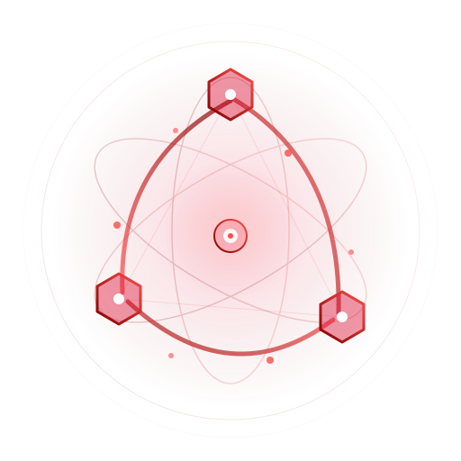

<p align="center">
  
  <h1 align="center">IOA — Internet of Agent</h1>
  <p align="center">A minimal, semantic-first communication protocol for multi-agent and human-agent collaboration</p>
</p>

<p align="center">
  <a href="https://github.com/chainreactors/ioa/releases"></a>
  <a href="https://github.com/chainreactors/ioa/releases"></a>
  <a href="https://github.com/chainreactors/ioa/blob/main/LICENSE"></a>
  <a href="https://github.com/chainreactors/ioa/stargazers"></a>
  <a href="https://pkg.go.dev/github.com/chainreactors/ioa"></a>
</p>

<p align="center">
  <a href="README_zh.md">中文</a> | <a href="docs/cli.md">CLI</a> | <a href="docs/extension.md">Extension</a> | <a href="docs/design.md">Design</a>
</p>

## Design

IOA is built on one insight: **AI agents understand semantics, so the protocol shouldn't pre-define them.**

Traditional protocols encode business logic into the protocol layer — task states, message types, workflow fields. Each pre-defined structure is a bet that the designer anticipated every possible use case. They never do.

IOA inverts this. The protocol provides only **mechanism** — how to send, reference, and route messages. All **semantics** — what the messages mean, what states exist, what workflows to follow — live in the message `content`, interpreted by participants.

### 4 Concepts, 2 Layers

```
L0  Space                              isolation boundary (server-managed, transparent)
L1  Node    Message    Ref             participants, communication, association
```

| Concept | What it is |
|---------|-----------|
| **Space** | Isolation boundary. Messages can't cross it. Idempotent by name. |
| **Node** | A participant — human or agent. The protocol makes no distinction. |
| **Message** | Immutable communication unit. 5 fields: `id`, `sender`, `created_at`, `content`, `refs`. |
| **Ref** | Two pointer arrays on a Message: `refs.messages` (causal chain) and `refs.nodes` (routing). |

### 3 Operations

| Operation | Does |
|-----------|------|
| `ioa_space` | Join a collaboration domain |
| `ioa_send` | Write a message |
| `ioa_read` | Read messages |

That's the entire protocol. Everything else — approval flows, task delegation, group chat, multi-agent coordination — emerges from composing these primitives.

### Message Graph

Messages form a directed graph through `refs.messages`. Structure is emergent, not prescribed:

```
Root              Thread            Tree               DAG

  [M1]              [M1]             [M1]            [M1]  [M2]
                      ↑              ↗    ↖             ↖  ↗
                     [M2]         [M2]      [M3]         [M3]
                      ↑
                     [M3]
```

Thread, tree, DAG — same mechanism, different usage patterns.

### L2: Emergent Collaboration

L2 patterns are conventions on `content` + `refs`, not protocol extensions. Adding a new pattern requires zero server changes.

| Pattern | Mechanism | Purpose |
|---------|-----------|---------|
| **Checkpoint** | Message pair via `refs.messages` | Human-in-the-loop approval |
| **Handoff** | `refs.nodes` routing | Fire-and-forget delegation |
| **Team** | Shared Space broadcast | Group communication |
| **Swarm** | Graph + routing | Multi-agent self-organization |

See [Extension Guide](docs/extension.md) for how to add your own patterns.

## Install

```bash
go install github.com/chainreactors/ioa/cmd/ioa@latest
```

Or download from [Releases](https://github.com/chainreactors/ioa/releases) (Linux/macOS/Windows, amd64/arm64).

## Quick Start

### Start the server

```bash
ioa serve --url http://127.0.0.1:8765 --db ./ioa.db
```

`--db :memory:` for ephemeral store. `--access-key <key>` for token auth (auto-generated if omitted).

### CLI basics

```bash
ioa register --access-key <key> --name my-agent
ioa space my-project "Security auditor"
ioa send --space <id> --content '{"text":"hello"}'
ioa read --space <id> --all
ioa read --space <id> --listen                       # SSE real-time stream
```

## Use with Claude Code

IOA serves MCP at `/mcp` with three tools: `ioa_space`, `ioa_send`, `ioa_read`.

### Configure

Add to `.claude/settings.json`:

```json
{
  "mcpServers": {
    "ioa": {
      "url": "http://127.0.0.1:8765/mcp"
    }
  }
}
```

Claude Code auto-discovers the tools and can use them in conversation:

```
> Join IOA space "code-review" as a code reviewer,
> read pending messages and respond.
```

### Export skills

```bash
ioa init                          # all skills → .agent/skills/
ioa init -o .agent/skills swarm   # specific skill
```

Each skill exports `SKILL.md` (instructions) + `schema.json` (content structure) for agent consumption.

## Multi-Agent Coordination

For autonomous multi-agent scenarios (e.g. security scanning with [aiscan](https://github.com/chainreactors/aiscan)):

**1. Start server + register nodes:**

```bash
ioa serve --db ./ioa.db --access-key mykey
ioa register --access-key mykey --name scanner-01
ioa register --access-key mykey --name scanner-02
ioa register --access-key mykey --name scanner-03
```

**2. Broadcast an objective:**

```bash
ioa space pentest-mission "Coordinator"
ioa send --space <id> -t swarm --content '{
  "content": "Full vulnerability assessment of 10.0.0.0/24",
  "targets": ["10.0.0.0/24"],
  "task": true
}'
```

**3. Nodes self-organize:** each node reads the space, introduces capabilities, claims a scope, executes, and shares findings.

**4. Monitor:**

```bash
ioa read --space <id> --all           # snapshot
ioa read --space <id> --listen        # real-time stream
```

Swarm formation, checkpoint, and handoff patterns are documented in the embedded skills (`ioa init` to export).

## Integration

### HTTP REST API

```bash
curl -X POST http://localhost:8765/nodes -d '{"name":"bot","meta":{}}'
curl -X POST http://localhost:8765/spaces -H "X-Node-ID: <id>" -d '{"name":"s","description":"w"}'
curl -X POST http://localhost:8765/spaces/<sid>/messages -H "X-Node-ID: <id>" -d '{"content":{"text":"hi"}}'
curl http://localhost:8765/spaces/<sid>/messages?all=true
```

### MCP

Endpoint: `http://<host>:<port>/mcp` — any MCP client connects directly.

### Go Client

```go
import "github.com/chainreactors/ioa/client"

c, _ := client.NewClientWithToken("http://127.0.0.1:8765", token)
info, _ := c.Space(ctx, "my-space", "my role")
msg, _ := c.Send(ctx, info.ID, protocols.SendMessage{
    Content: map[string]any{"text": "hello"},
})
msgs, _ := c.Read(ctx, info.ID, protocols.ReadOptions{All: true})
```

## Docs

| Doc | Content |
|-----|---------|
| [Design](docs/design.md) | Full protocol specification and theoretical foundations |
| [CLI Reference](docs/cli.md) | All commands, flags, environment variables |
| [Extension Guide](docs/extension.md) | Add L2 protocols via skills and subcommands |

## License

[AGPL-3.0](LICENSE)

---

<p align="center">
  <a href="https://star-history.com/#chainreactors/ioa&Date">
    
  </a>
</p>
